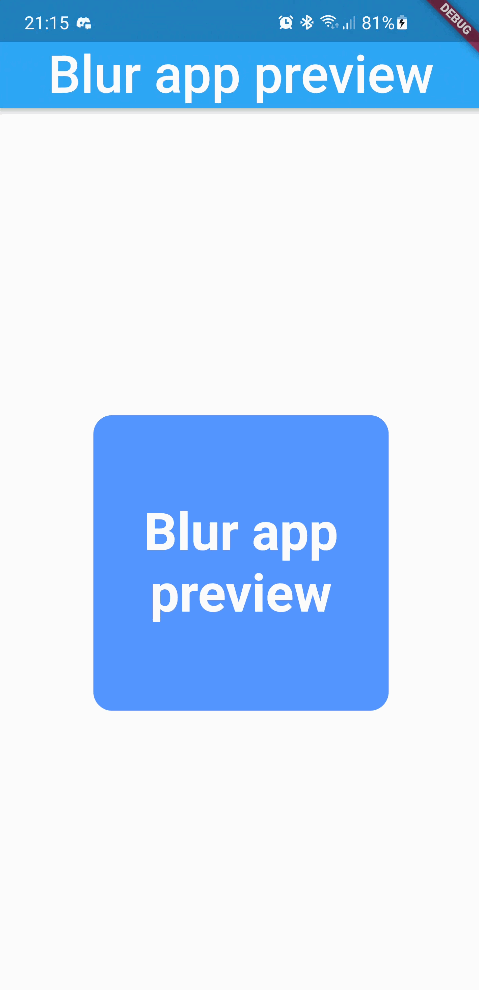
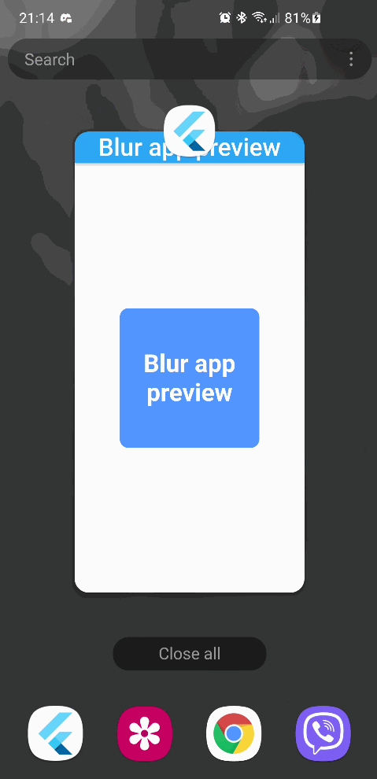

# blur_app_preview

An example to blur the app preview when paused. Handy if you want to hide sensitive information, or you just want to blur your app when on app drawer.

## Screenshot

</img>

## Notes

There is currently a bug which I haven't yet tackled. On first app pause, the app preview doesn't retain the blur. As shown on below GIF. After the first switch, the blur works fine. Feel free to open a PR or open an issue recommending a fix.

</img>
